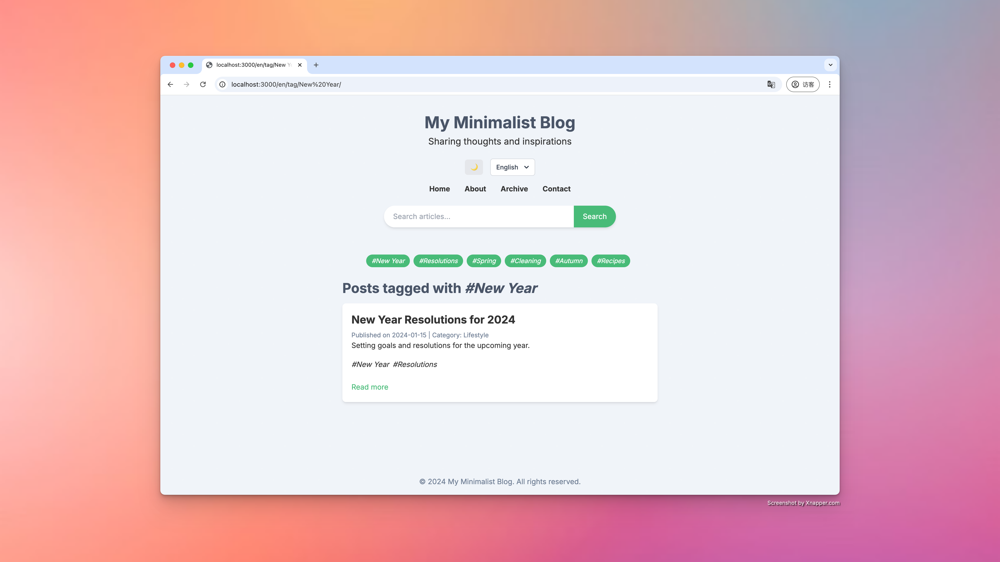

# Minimalist Blog

This is a minimalist blog project built using Next.js, React, and TypeScript.

<p align="center">
  
  
</p>

## One-Click Deployment

### Deploy to Vercel

[](https://vercel.com/new/import?s=https%3A%2F%2Fgithub.com%2Fzsai001%2Fsblog)

Click the button above to deploy this project to Vercel. You'll need to:

1. Connect your GitHub account to Vercel (if not already done).
2. Select "Import Project" and then "From Git Repository".
3. Choose a name for your project.
4. Click "Deploy" and wait for the process to complete.

### Deploy to Cloudflare Pages

[](https://dash.cloudflare.com/?to=/:account/workers-and-pages/create/pages)

Click the button above to deploy this project to Cloudflare Pages. You'll need to:

1. Connect your GitHub account to Cloudflare (if not already done).
2. Select the repository you want to deploy.
3. Choose a name for your project.
4. Set the following environment variables:
   - `NODE_VERSION`: 18.x
5. Configure your build settings:
   - Build command: `npm run build`
   - Build output directory: `out`
6. Click "Save and Deploy" and wait for the process to complete.

Note: Make sure to configure your environment variables and any necessary build settings in your Cloudflare Pages dashboard after the initial deployment.

## Features

- Built with Next.js and TypeScript
- Responsive design (using Tailwind CSS)
- Multi-language support (English and Chinese)
- Static site generation for improved performance
- Article archive page
- Tag-based navigation
- Dark mode support
- Markdown files for blog posts and static pages
- AI-driven, friendly for secondary development

## How to Deploy

1. Clone the repository:
   ```
   git clone https://github.com/zsai001/sblog.git
   cd sblog
   ```

2. Install dependencies:
   ```
   npm install
   ```

3. Configure environment variables:
   Copy the `config.exp.yaml` file and rename it to `config.yaml`, then fill in the necessary configuration information.

4. Build the project:
   ```
   npm run build
   ```

   This will generate a static version of your site in the `out` directory.

5. To preview the static site locally:
   ```
   npx serve out
   ```

## Article Management

1. Create your blog posts and pages in the `content` directory using Markdown format.
2. Run `main.py` to publish articles.

## Project Structure

- `src/app`: Next.js application routing structure
- `src/components`: Reusable React components
- `src/utils`: Utility functions, including Markdown parsing
- `src/contexts`: React context for language management
- `src/translations`: Internationalization strings
- `content`: Markdown files for blog posts and pages in different languages

## Development Practices

- Use TypeScript for type safety
- Modular component design
- Separation of concerns (e.g., utility functions, components, pages)
- Use Tailwind CSS classes for responsive design

## Contributing

Contributions are welcome! Please check out [CONTRIBUTING.md](CONTRIBUTING.md) to get started.

## License

This project is licensed under the MIT License - see the [LICENSE.md](LICENSE.md) file for details.